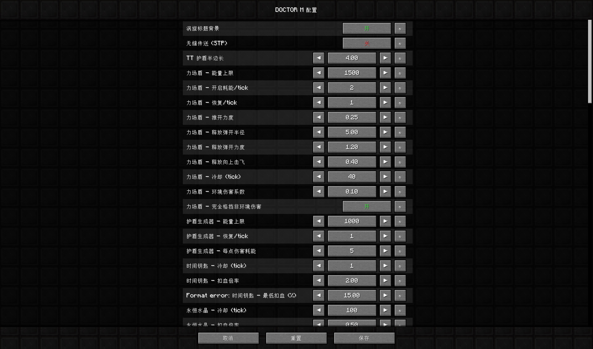

# 配置系统 / Configuration



**DOCTOR M** 提供了**近百项可配置项**，覆盖模组绝大部分功能。伤害数值、能力参数、燃料消耗、搜索范围……几乎所有能想到的数值都能改。

> 💡 **配置文件位置：** `config/doctor_m.json`  
> 💡 **配置界面命令：** `/doctor_m config`

---

## 打开配置界面

有两种方式打开图形化配置界面。

### 方式 1：游戏内命令

```text
/doctor_m config
```

**任何玩家**都能使用，不需要 OP 权限。

### 方式 2：ModMenu

如果你安装了 **Mod Menu**，可以在模组列表里找到 DOCTOR M，点击右侧的**齿轮图标**直接打开配置界面。

> 推荐用 ModMenu——不用记命令，还能看到模组信息。

---

## 界面操作

配置界面是**深色主题**，支持以下操作：

| 控件 | 操作 |
|---|---|
| **开关按钮** | 点击切换“开 / 关” |
| **数值步进器** | 点击 ◀ / ▶ 调整数值 |
| **Shift + 点击** | 步长 **×10**（快速调整） |
| **Ctrl + 点击** | 步长 **×100**（超大跨度调整） |
| **每行 ↻ 按钮** | 重置该项为默认值 |
| **底部“重置”** | **按住 Shift** 点击，重置所有配置 |
| **底部“保存”** | 写入配置文件并立即生效 |
| **底部“取消”** | 丢弃改动，恢复上次保存的配置 |

> ⚠️ **点击“保存”后配置立即生效**——大部分功能不需要重启游戏。

---

## 配置项分类

以下按模块分类列出所有可配置项。

> 💡 配置项会随着模组更新增加。新版本可能引入新项，旧配置文件会自动使用新项的默认值。

---

### 🎬 界面 / 渲染

| 配置项 | 默认值 | 说明 |
|---|---|---|
| **涡旋标题背景** | 开 | 是否显示涡旋背景图。 |
| **无缝传送 (STP)** | 开 | 进出塔迪斯、使用涡旋操纵器、时间钥匙跨维度时，是否使用无加载屏幕传送。 |

> ⚠️ **装了沉浸式传送门（Immersive Portals）的玩家建议关闭 STP**——两者渲染管线冲突。

---

### 🛡️ 防御装备

#### TT 护盾

| 配置项 | 默认值 | 说明 |
|---|---|---|
| **半边长** | 4.0 | 护盾立方体半边长（总边长 = 2 × 此值）。 |

#### 力场盾牌

| 配置项 | 默认值 | 说明 |
|---|---|---|
| **能量上限** | 1500 | 力场能量最大值。 |
| **开启耗能 / tick** | 2 | 力场展开期间每 tick 消耗。 |
| **恢复 / tick** | 1 | 未使用时每 tick 恢复。 |
| **推开力度** | 0.25 | 力场内实体的持续推力。 |
| **释放弹开半径** | 5.0 | 松开右键的爆发半径。 |
| **释放弹开力度** | 1.2 | 爆发水平击退。 |
| **释放向上击飞** | 0.4 | 爆发垂直击飞。 |
| **冷却 (tick)** | 40 | 松开后的冷却时间。 |
| **环境伤害系数** | 0.1 | 环境伤害保留比例（10%）。 |
| **完全格挡非环境伤害** | 开 | 是否完全免疫非环境伤害。 |

#### 护盾生成器

| 配置项 | 默认值 | 说明 |
|---|---|---|
| **能量上限** | 1000 | 护盾能量最大值。 |
| **恢复 / tick** | 1 | 每 tick 恢复量。 |
| **每点伤害耗能** | 5 | 吸收每点伤害消耗的能量。 |

---

### ⚔️ 武器

#### 时间钥匙

| 配置项 | 默认值 | 说明 |
|---|---|---|
| **冷却 (tick)** | 1 | 百分比扣血触发间隔。 |
| **扣血倍率** | 2.0 | 扣血强度。 |
| **最低扣血 (%)** | 15.0 | 至少扣除的最大生命值百分比。 |

#### 永恒水晶

| 配置项 | 默认值 | 说明 |
|---|---|---|
| **冷却 (tick)** | 100 | 百分比扣血触发间隔。 |
| **扣血倍率** | 0.5 | 扣血强度。 |
| **最低扣血 (%)** | 2.5 | 至少扣除的最大生命值百分比。 |

#### 特莉波卡的镰刀

| 配置项 | 默认值 | 说明 |
|---|---|---|
| **冷却 (tick)** | 30 | 百分比扣血触发间隔。 |
| **扣血倍率** | 1.0 | 扣血强度。 |
| **最低扣血 (%)** | 25.0 | 至少扣除的最大生命值百分比。 |
| **右键斩击伤害** | 500.0 | 灵魂收割基础伤害。 |
| **AoE 半径** | 5.0 | 伤害溅射范围。 |
| **饥饿回复基础值** | 1 | 处决回血时同步回复的饱食度。 |
| **饱和度系数** | 0.5 | 处决回血时同步回复的饱和度。 |
| **处决吸血比例** | 0.6 | 处决回血占伤害的百分比。 |
| **普通吸血比例** | 0.25 | 普通命中回血占比。 |
| **处决 AoE 无视护甲** | 开 | 处决溅射是否无视减伤。 |

#### STCS

| 配置项 | 默认值 | 说明 |
|---|---|---|
| **格挡最低能量消耗** | 1 | 剑封锁时的最低能耗。 |
| **范围伤害半径** | 3.0 | AoE 溅射范围。 |

---

### 🚀 塔迪斯

#### 自毁

| 配置项 | 默认值 | 说明 |
|---|---|---|
| **总开关** | 开 | 是否启用自毁增强。 |
| **最大扩散半径** | 80 | 爆炸波的最大范围。 |
| **扩散步数** | 20 | 扩散动画的步数。 |
| **每步间隔 (tick)** | 40 | 每步之间的 tick 间隔。 |
| **最终清除半径** | 100 | 最终清除范围。 |
| **击退半径** | 2 | 击退影响范围。 |
| **击退力度** | 0.5 | 击退强度。 |

---

### 🌌 太空系统

#### 氧气瓶

| 配置项 | 默认值 | 说明 |
|---|---|---|
| **最大容量** | 1200.0 | 普通氧气瓶容量。 |
| **每次转移量** | 100.0 | 给宇航服补氧时每次转移量。 |
| **饱食度阈值** | 6 | 低于此值视为“极度饥饿”（可用于触发食用彩蛋）。 |
| **成就长按时长** | 100 | 触发成就所需的长按 tick。 |
| **高级容量倍率** | 3.0 | 高级氧气瓶容量 = 普通 × 3。 |
| **超级容量倍率** | 5.0 | 超级氧气瓶容量 = 普通 × 5。 |
| **喷气推力强度** | 0.5 | 喷气氧气瓶推力。 |
| **喷气惯性保留** | 0.72 | 喷气氧气瓶惯性保留比例。 |
| **喷气重力补偿** | 0.12 | 喷气氧气瓶重力补偿。 |
| **喷气最大水平速度** | 8.0 | 喷气氧气瓶最大水平速度。 |
| **喷气最大垂直速度** | 6.0 | 喷气氧气瓶最大垂直速度。 |

#### 氧气补充机

| 配置项 | 默认值 | 说明 |
|---|---|---|
| **冷却 (秒)** | 32 | 每次使用后的制氧等待时间。 |

#### 宇航服

| 配置项 | 默认值 | 说明 |
|---|---|---|
| **最大氧气** | 1200.0 | 宇航服最大氧气容量。 |
| **水下耗氧** | 0.5 | 水下每 2 秒消耗的氧气量。 |
| **太空耗氧** | 1.0 | 太空无氧环境每 3 秒消耗的氧气量。 |

#### 制氧机

| 配置项 | 默认值 | 说明 |
|---|---|---|
| **最大供氧半径** | 48 | 制氧机最大供氧半径。 |
| **开放空间半径** | 3 | 开放空间有效半径。 |
| **缓存过期 (tick)** | 100 | 制氧机缓存过期时间。 |
| **最小有效房间体积** | 10 | 最小有效房间大小。 |

#### 真空进食

| 配置项 | 默认值 | 说明 |
|---|---|---|
| **每次耗氧** | 100.0 | 真空环境吃一次食物扣多少氧。 |
| **超时 (秒)** | 10 | pending 状态超时。 |

---

### 🔧 道具

#### 玩具匠的锤子

| 配置项 | 默认值 | 说明 |
|---|---|---|
| **复制区块半径** | 20 | 复制塔迪斯时的区块半径。 |
| **生成偏移 (格)** | 2 | 复制塔迪斯的生成偏移。 |
| **触及距离** | 5.0 | 锤子的触及距离。 |
| **方块更新 flags** | 2 \| 16 | 方块更新 flags。 |
| **复制实体** | 开 | 是否复制实体。 |
| **复制方块实体** | 开 | 是否复制方块实体。 |

#### 追踪器 / 心灵感应电路

| 配置项 | 默认值 | 说明 |
|---|---|---|
| **手持扫描半径** | 45.0 | 拿着追踪器时的自动扫描范围。 |
| **右键扫描容器半径** | 45 | 右键扫描的容器检测范围。 |
| **心灵感应搜索半径** | 5120 | 心灵感应电路的远程搜索半径。 |
| **结构搜索半径** | 51200 | 结构搜索范围。 |
| **黑名单容差** | 128 | 同一结构在此距离内视为已标记。 |
| **结构搜索重试次数** | 5 | 搜索下一个结构时的最大重试。 |
| **锁定碎片燃料消耗** | 300 | 锁定碎片消耗的塔迪斯燃料。 |
| **锁定结构燃料消耗** | 600 | 锁定结构消耗的塔迪斯燃料。 |
| **着陆随机偏移** | 40 | 塔迪斯在目标附近 ±N 格着陆。 |
| **治疗回血量** | 8.0 | 心灵感应电路空手潜行右键回血。 |
| **治疗饱食度** | 4 | 心灵感应电路空手潜行右键回复的饱食度。 |
| **治疗饱和度** | 0.5 | 心灵感应电路空手潜行右键回复的饱和度。 |

#### 涡旋操纵器

| 配置项 | 默认值 | 说明 |
|---|---|---|
| **最大燃料** | 1500 | 涡旋操纵器最大燃料。 |
| **最大过热** | 100 | 涡旋操纵器最大过热。 |
| **冷却 (tick)** | 1200 | 普通冷却，1200 tick = 60 秒。 |
| **损坏恢复 (tick)** | 72000 | 核心熔毁后的恢复时间，72000 tick = 3 游戏日。 |
| **散热间隔** | 80 | 每 80 tick 散热一次。 |
| **每次散热量** | 1 | 每次散热减少的过热量。 |

---

## 使用技巧

### Shift / Ctrl 加速调整

调整数值时按住修饰键：

| 修饰键 | 步长倍数 | 用途 |
|---|---|---|
| **无** | ×1 | 精细调整。 |
| **Shift** | ×10 | 快速调整。 |
| **Ctrl** | ×100 | 超大跨度（如 5120 → 512000）。 |

> 调整燃料上限、搜索半径这类大数值时特别有用。

### 重置功能

| 操作 | 效果 |
|---|---|
| **每行 ↻** | 只重置该项。 |
| **底部“重置”（需 Shift）** | 重置**所有**配置为默认值。 |

> “重置”按钮需要**按住 Shift 才能点击**——防止误触。

### 保存 vs 取消

| 按钮 | 行为 |
|---|---|
| **保存** | 写入 `doctor_m.json` + 立即生效。 |
| **取消** | 丢弃改动，恢复上次保存的值。 |

> ⚠️ 关闭界面时如果没点保存，**改动会丢失**。

### 手动编辑配置

如果你更喜欢直接改文件，可以打开 `config/doctor_m.json`，所有字段都是**英文键名**（如 `tracerScanRange`），修改后**重启游戏**生效。

---

## 冷知识

- **配置文件是 JSON 格式**——用文本编辑器打开就能改，语法简单。
- **配置界面实时刷新**——你改一个数值，相关的功能立刻用新值。
- **Shift / Ctrl 加速是配置界面独有的**——不影响游戏内其他地方。
- **追踪器的“治疗”功能也是可配置的**——如果觉得回血太强，可以把 `tracerHealAmount` 调低。
- **“重置”按钮需要 Shift 是故意的**——防止玩家不小心把辛苦调好的配置一键清空。
- **配置项会随着模组更新增加**——新版本可能会引入新的可配置项，旧配置文件会自动使用新项的默认值。
- **配置界面无需 OP 权限**——任何玩家都能打开，但改的是本地配置。
- **STP 与沉浸式传送门冲突**——装 IP 的玩家建议关闭 STP，避免渲染管线打架。