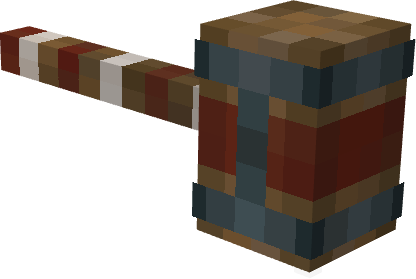

# 玩具匠的锤子 / Toymaker's Hammer

> **类型：** 神级道具
> **来源：** DOCTOR M / AIT
> **相关配置：** `toymakerHammerCopyChunkRadius`、`toymakerHammerCopyEntities` 等  
> **相关结构：** 塔迪斯

---

## 概述

**玩具匠的锤子**是一件神级道具，能完成一项“不可能”的任务：**完整复制一台现存的塔迪斯**——彻底、独立、没有任何关联。

> ⚠️ **警告：** 这不是玩具。好吧，它确实是玩具匠的锤子，但它会复制一整个塔迪斯。多人服务器上请自重。因为它非常的变态。

> 💡 **彩蛋：** “玩具匠（Toymaker）”致敬了经典《神秘博士》反派——他视现实为一场游戏。

---

## 获取方式

*暂无。*

---

## 使用方法

### 操作步骤

| 步骤 | 操作 |
|---|---|
| 1 | **按住右键**对准塔迪斯外壳方块，开始蓄力。 |
| 2 | **持续按住至少 2 秒**（40 tick）。提前松手会静默取消。 |
| 3 | **松手**。如果对准的是有效、已绑定的塔迪斯外壳，复制流程启动。 |

> 💡 物品使用**弓的动作动画**，所以玩家看起来像是把锤子当弓拉。

### 目标规则

- 必须**直接看向外壳方块**。
- 外壳必须**已绑定到一台塔迪斯**。未绑定的外壳会被忽略。
- 复制体生成在**你面前的塔迪斯的后方 2 格**（按你的水平朝向计算）。

---

## 复制效果

成功后，你会得到一台**全新的、完全独立的塔迪斯**。

| 项目 | 说明 |
|---|---|
| **位置** | 生成在你面前的原塔迪斯的后方 2 格，朝向与原塔迪斯一致。 |
| **内部空间** | 完整复制原塔迪斯内部——方块、容器、怪物、展示框、盔甲架等全部保留。 |
| **状态** | 内饰方案、外观变体、忠诚度、飞行数据、燃料、统计、名字全部保留。 |
| **归属** | 使用锤子的玩家会被添加为**旅伴**（不是主人）。 |

**复制体与原塔迪斯完全独立**——改一个不影响另一个。

> ⚠️ **注意：** 内部空间只复制**中心点半径 48 格**内的内容。球体范围外的任何东西都不会被复制。

### 视觉反馈

成功后，源塔迪斯和复制体位置都会播放震撼特效：

| 位置 | 特效 |
|---|---|
| **源位置** | 铁砧落地音效、爆炸 + 闪光 + 云粒子、末地烛、暴击火花。 |
| **复制体** | 末地传送门生成音效、传送门粒子、附魔粒子、末地烛、女巫魔法。 |

> 原塔迪斯**完全无损**，只是特效看起来很爆炸。

---

## 限制与失败

| 情况 | 结果 |
|---|---|
| **蓄力 < 2 秒** | 静默取消，什么都不发生。 |
| **没看准方块** | 静默取消。 |
| **目标不是塔迪斯外壳** | 聊天栏提示：*“那不是塔迪斯。”* |
| **外壳未绑定** | 静默取消。 |
| **塔迪斯管理器已满** | 聊天栏提示：*“塔迪斯管理器已满。”* |
| **复制过程中出错** | 聊天栏提示：*“复制失败。”* + 服务端日志。 |

---

## 配置项

玩具匠的锤子的部分数值可在 `config/doctor_m.json` 中调整：

| 键 | 默认值 | 说明 |
|---|---|---|
| `toymakerHammerCopyChunkRadius` | 20 | 复制塔迪斯时的区块半径。 |
| `toymakerHammerSpawnOffsetBlocks` | 2 | 复制塔迪斯的生成偏移。 |
| `toymakerHammerReachDistance` | 5.0 | 锤子的触及距离。 |
| `toymakerHammerBlockUpdateFlags` | 2 \| 16 | 方块更新 flags。 |
| `toymakerHammerCopyEntities` | 开 | 是否复制实体。 |
| `toymakerHammerCopyBlockEntities` | 开 | 是否复制方块实体。 |

---

## 冷知识

- 物品使用**弓的动作动画**，所以玩家看起来像是把锤子当弓拉。
- 复制出来的塔迪斯是**真正独立的实例**——改一个不影响另一个。
- “玩具匠（Toymaker）”致敬了经典《神秘博士》反派——他视现实为一场游戏。
- **内部复制有半径限制**——只复制中心点半径 48 格内的内容，超出范围的不会被复制。
- **使用锤子的玩家会被添加为旅伴，而不是主人**——这一点和原塔迪斯的归属不同。
- **原塔迪斯完全无损**——复制过程不会对源塔迪斯造成任何影响，特效只是看起来吓人。
- **复制体可以有自己的内饰、外观、燃料、名字**——所有状态都完整继承。